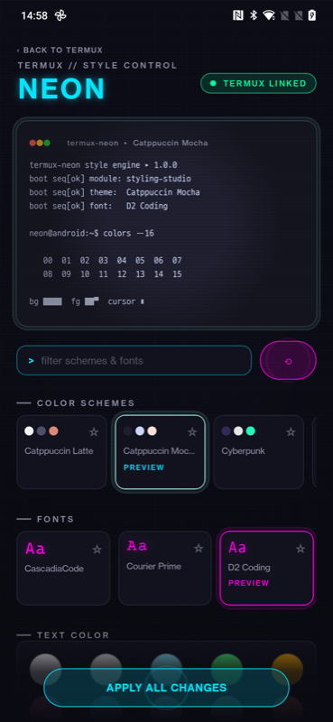
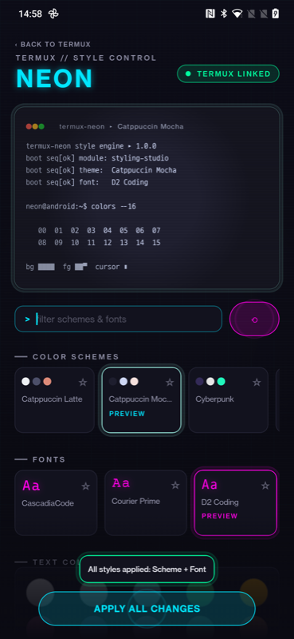
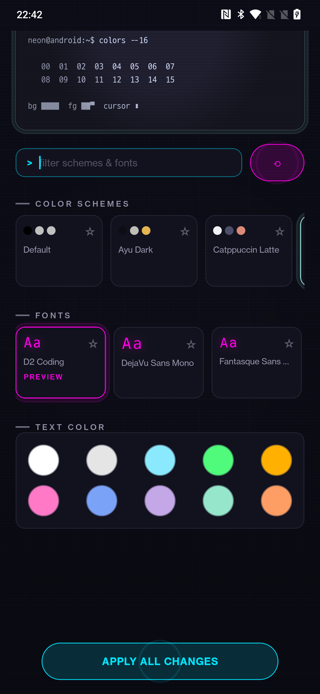

<div align="center">


[](https://github.com/neonbytecode/termux-neon/actions/workflows/github_action_build.yml)
[](LICENSE)
[](https://github.com/neonbytecode/termux-neon/releases)

</div>

A [Termux](https://termux.org) add-on to customize the terminal's font and
color theme, with a neon-styled Compose UI, live preview, and one-tap apply
that hot-reloads the running Termux session — no restart needed.

This is a from-scratch Compose rewrite of Termux's official
[termux-styling](https://github.com/termux/termux-styling) add-on. It keeps
the exact same plugin contract — the `com.termux.styling` package and shared
user ID — so it installs and runs exactly where the upstream add-on did.

<div align="center">



</div>

## Features

- **15 curated color schemes** — Catppuccin Mocha/Latte, Cyberpunk, Gotham,
  Solarized Dark/Light, Dracula, Nord, Gruvbox Dark, Tokyo Night, Rosé Pine,
  Monokai, One Dark, Ayu Dark, and Kanagawa.
- **A large bundled font collection**, including popular
  [Nerd Fonts](https://www.nerdfonts.com/)-patched monospace fonts and
  D2 Coding — see `app/src/main/assets/fonts/` for the current set, and
  `THIRD_PARTY_LICENSES.md` for each font's license and source.
- **Live preview** of the selected scheme/font before applying anything.
- **Favorites** — star schemes and fonts, which then sort to the top.
- **Search/filter** across both schemes and fonts.
- **Shuffle** — randomly preview a scheme/font combination.
- **Custom text color** — an independent foreground-color override, picked
  from 10 curated swatches, applied on top of whatever scheme is selected.
- **Apply All** — one action applies the selected scheme, font, and text
  color together, then hot-reloads the live Termux session.

## Installation

> [!IMPORTANT]
> This app must be signed with the same key as your Termux install (shared
> `sharedUserId="com.termux"`) or Android will refuse to install it, or it
> won't have permission to write `~/.termux/colors.properties` /
> `~/.termux/font.ttf`. **Install Termux Neon from the same source you
> installed Termux from** — mixing sources (e.g. an F-Droid Termux with a
> GitHub-built Termux Neon) will fail.

- **F-Droid** — the primary, recommended channel once the listing is live
  (matches how the original `termux-styling` is distributed; F-Droid builds
  and signs the whole Termux app family itself, so the signature always
  matches an F-Droid-installed Termux).
- **GitHub Releases** — direct APK download from the
  [Releases page](https://github.com/neonbytecode/termux-neon/releases).
  **This build is signed with an untrusted debug key** and will only work
  alongside a self-built, debug-signed Termux — it is an advanced/testing
  channel, not for most users running official Termux.
- **Build it yourself**:

  ```sh
  ./gradlew :app:assembleDebug
  adb install app/build/outputs/apk/debug/app-debug.apk
  ```

  The debug APK uses Gradle's local debug signing configuration and is for
  testing only; it will not install beside an official Termux build unless
  both apps are signed by the same key. Per-push CI builds are also available from the
  [workflow runs](https://github.com/neonbytecode/termux-neon/actions/workflows/github_action_build.yml).
  See <https://github.com/termux/termux-app#Installation> for background on
  why signature sources must match across Termux and its plugins.

  ### Distribution and signing

  Termux Neon must be installed from the same distribution source as Termux:

  | Termux source | Termux Neon source |
  |---|---|
  | F-Droid | F-Droid |
  | A self-built debug Termux | A locally built debug APK |
  | A self-built release Termux | A locally signed release APK using the same key |

  The GitHub Actions APK is a debug/testing artifact. It is not signed with the
  F-Droid or official Termux release key and should not be presented as a
  general-purpose installation for those builds. F-Droid builds and signs its
  own artifact when the metadata submission is accepted.

## How to use

1. When inside Termux, long press anywhere on the terminal.
2. Select `More...` in the resulting dialog.
3. Select `Style` in the next dialog.
4. In the app, pick a color scheme, a font, and/or a text color by tapping
   its card or swatch. The preview at the top updates live; cards show a
   `PREVIEW` or `APPLIED` badge depending on state.
5. Tap **Apply All** to install your selection. Termux reloads its style
   live over a package-scoped broadcast — no restart needed.

If the scheme/font is changed outside of the app (e.g. `echo` into
`~/.termux/colors.properties`), the badges re-sync when the app resumes.

Favorites are stored in the app's private `SharedPreferences`; they are not
written to Termux's style files. A selected preview is also local UI state.
Only **Apply All** writes `colors.properties` and `font.ttf`.

## Troubleshooting

### “Termux not found”

Install Termux before launching the add-on, then reopen Termux Neon.

### “Signed by a different source”

Uninstall both apps and reinstall them from the same distribution. Android's
shared-UID contract requires the APK signatures to match; an F-Droid Termux
cannot share files with a GitHub debug APK, and vice versa.

### Styles apply but the terminal does not update

Return to Termux after applying. The add-on writes the files first and sends a
package-scoped reload broadcast when Termux is foregrounded. If the terminal
still does not repaint, verify that the files exist under
`~/.termux/colors.properties` and `~/.termux/font.ttf`, then retry from the
same-source installation.

### The app shows an inaccessible Termux environment

This usually indicates a mismatched signature, an incomplete Termux
installation, or inaccessible Termux private storage. Reinstall both apps
from the same source before reporting a bug.

## Release process

1. Update the version and `CHANGELOG.md`.
2. Run `./gradlew testDebugUnitTest lintDebug :app:assembleDebug :app:assembleRelease`.
3. Confirm the F-Droid recipe points at the release tag.
4. Create and push an annotated `vMAJOR.MINOR.PATCH` tag.
5. Create the GitHub release with debug artifacts clearly marked as testing
   only. The release workflow validates debug and unsigned release APKs but
   does not hold or use a production signing key.
6. Submit or update the F-Droid metadata separately; F-Droid performs its
   own build and signing.

## Why the shared UID is required

The legacy Termux add-on contract uses `android:sharedUserId="com.termux"`
and the `com.termux.styling` application ID. This allows the add-on to access
Termux's private `~/.termux` files and is why signature matching is mandatory.
The manifest also exposes `TermuxStyleActivity`, which Termux launches from
its Style menu. Do not remove or rename these compatibility identifiers
without coordinating an upstream migration.

## Relationship to termux-styling

Termux Neon is not a patch on top of `termux/termux-styling` — it's a
ground-up rewrite of the UI in Jetpack Compose, with the app split into
small, testable modules (see below). The plugin contract Termux relies on
(package name, shared user ID, the files it reads/writes under
`~/.termux/`) is kept identical, so it's a drop-in replacement from Termux's
point of view. Full credit to the original `termux-styling` authors and the
wider Termux project — this project wouldn't exist without their work
establishing that contract. See `THIRD_PARTY_LICENSES.md` for licensing of
every bundled font and color scheme.

## Development

The project is split into small modules:

- `:app` — Compose UI, state, and the `TermuxStyleActivity` the plugin jumps to.
- `:core:theme-engine` — ANSI palette model and `colors.properties` parser.
- `:core:termux` — catalog of bundled schemes/fonts, applied-style reader, writer.
- `:core:designsystem` — Neon theme and reusable building blocks.

```sh
./gradlew testDebugUnitTest lintDebug :app:assembleDebug :app:assembleRelease
```

On an attached emulator or device, run the Compose instrumentation tests with:

```sh
./gradlew :app:connectedDebugAndroidTest
```

Requires JDK 17+; AGP 9 builds Kotlin with its built-in compiler (version via
`gradle/libs.versions.toml`).

GitHub release workflows validate both debug and unsigned release APKs and
publish them as workflow artifacts. Release signing is intentionally not
performed in CI without a separately managed signing key; F-Droid signs its
own builds.

The `setup-fonts.sh` / `setup-nerd-fonts.sh` scripts regenerate the bundled
font assets. `fontpatcher-py3.patch` patches the powerline font patcher for
Python 3 and is applied by `setup-fonts.sh`.

See `CONTRIBUTING.md` for how to propose changes, including adding new fonts
or color schemes.

## Contributing

See [`CONTRIBUTING.md`](CONTRIBUTING.md). This project follows the
[Contributor Covenant](CODE_OF_CONDUCT.md).

## License

GPLv3-only — see [`LICENSE`](LICENSE). Third-party bundled fonts and color
schemes retain their own licenses; see
[`THIRD_PARTY_LICENSES.md`](THIRD_PARTY_LICENSES.md).
